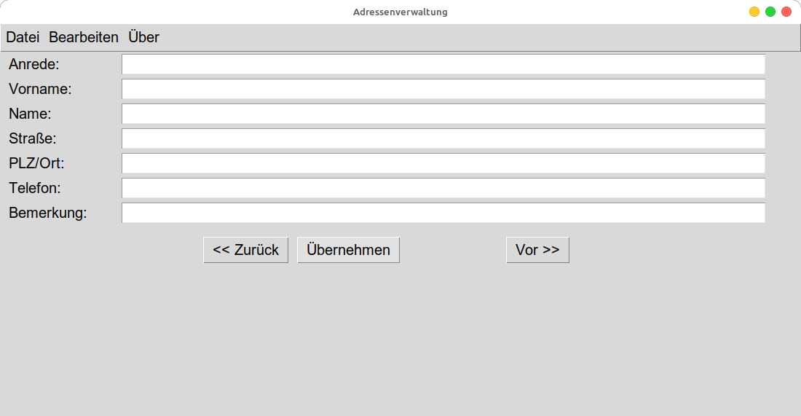

# 📇 Adressenverwaltung 2026



**Ein modernes Python-Tool mit Amiga-Heritage**

Dieses Programm ist eine moderne Portierung einer klassischen Adressenverwaltung. Es verbindet die Effizienz von **Python 3** und **Tkinter** mit der Datenintegrität historischer `.adr`-Datenbestände.

---

## 🌟 Highlights

* **💾 Retro-Kompatibilität**: Liest und schreibt das klassische Amiga-Adressformat (`.adr`) mit Latin-1 Kodierung.
* **🐧 Plattformunabhängig**: Läuft unter Linux (inkl. WSL), Windows und macOS.
* **🔐 Rechtesicher**: Nutzt `pathlib`, um Exporte im Benutzer-Home-Verzeichnis zu speichern – ideal für Installationen in geschützten Verzeichnissen wie `/opt/`.
* **📊 Dynamische Tabellen**: Exportiert gefilterte Adresslisten als sauber formatierte Text-Tabellen mit automatischer Spaltenbreiten-Berechnung.

---

## 🛠 Features

* **🔍 Suchen & Sortieren**: Schnelle Volltextsuche und Sortierung nach beliebigen Feldern (Name, PLZ, Ort, etc.).
* **📝 Übernahme-Logik**: Erkennt ungespeicherte Änderungen und bietet eine Sicherheitsabfrage beim Beenden.
* **⌨️ GUI-Komfort**: Inklusive Tastenkürzel (Shortcuts):
    * `Strg + L`: Datei laden
    * `Strg + S`: Speichern
    * `Strg + F`: Suchen
    * `Strg + B`: Beenden
* **🎯 Zentrierte Darstellung**: Das Hauptfenster startet immer perfekt zentriert auf dem Bildschirm.
* **Multi-Monitor-Setup**: Die Zentrierungs-Funktion in functions/center.py nutzt jetzt screeninfo.

---

## 📂 Installation & Nutzung

### Voraussetzungen
* **Python 3.x**
* **Tkinter** (Unter debian-basierten Linux-Distributionen: `sudo apt install python3-tk`)
* **screeninfo** (Unter debian-basierten Linux-Distributionen: `sudo apt install python3-screeninfo`)
* Windows/Universal: `pip install screeninfo`

### Start
1. Repository klonen oder ZIP herunterladen:
   ```bash
   git clone [https://github.com/Michael2211967/Adressenverwaltung.git](https://github.com/Michael2211967/Adressenverwaltung.git)

* **Für die grafische Oberfläche (GUI):** `adressen.pyw`
* **Für die Konsolenausgabe (CLI):** `adressen.py Datei.adr`
